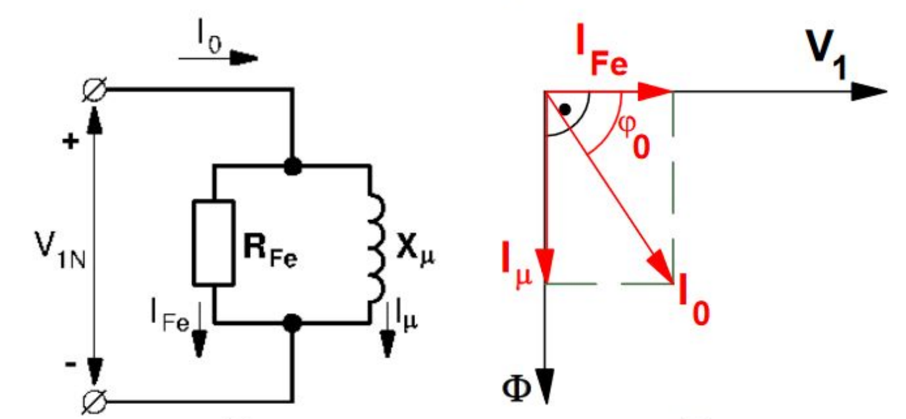

# Proyecto de Máquinas Eléctricas I - IE0315

Universidad de Costa Rica\
Escuela de Ingeniería Eléctrica\
Máquinas Eléctricas I - IE0315

Estudiantes:

- Sergio Garino Vargas - B73157
- Daniela Cantillo Arias - B91597

Grupo 3\
Profesor: Fausto Calderón Obaldía

## Descripción

El siguiente programa calcula los parámetros del circuito equivalente de un transformador monofásico dados los resultados de las pruebas de vacío y de corto circuito, así como los datos de placa.

Es importante tomar en cuenta las siguientes consideraciones:

- El circuito equivalente para el que se calculan los parámetros es tal como se muestra en la siguiente imagen.


- El ensayo de vacío se debe realizar en el lado de BT y el ensayo de cortocircuito en el lado de AT.
- Los parámetros a calcular son:
  - Rfe: Resistencia del núcleo.
  - Xu: Reactancia del núcleo.
  - Rcc: Resistencia de cortocircuito.
  - Xcc: Reactancia de cortocircuito.

El código cuenta con la función `def mostrar_imagen(ruta_imagen)` que se encarga de mostrarle al usuario la iamgen del circuito.

También se cuenta con la función `def calcular_parametros_transformador(vacio, cortocircuito, voltaje_primario, voltaje_secundario, potencia_nominal)` la cual se encarga de hacer los cálculos de los parámetros del circuito, para calcular los parámetros del circuito se siguen los siguientes pasos:

1. La resistencia $R_{Fe}$ y la reactancia $X_{\mu}$ del núcleo se calculan a partir de los resultados de la prueba de vacío.

2. La resistencia $R_{cc}$ y la reactancia $X_{cc}$ se calcular a partir de la prueba de corto circuito.

Lo primero que se hace es obtener las tensiones e intensidades asignadas al primario y al secundario. Las tensiones del primario $V_{1N}$ y del secundario $V_{2N}$ se obtienen de los datos del transformador, mientras que las corrientes salen de la potencia nominal $S_N$ y las tensiones anteriores, de manera que:

$$I_{1N}=\frac{S_N}{V_{1N}}$$

$$I_{2N}=\frac{S_N}{V_{2N}}$$

A partir del ensayo de vacío el cual se tuvo que haber hecho en el lado de BT y se calculan $R_{Fe}$ y $X_{\mu}$ a partir de la Ley de Ohm de manera que:

$$R_{Fe}=\frac{V_{1N}}{I_{Fe}}$$

$$X_{\mu}=\frac{V_{1N}}{I_{\mu}}$$

Donde $V_{1N}$ viene de la tensión medida en el vacío, tal como se muestra a continuación:



La corriente $I_{Fe}$ viene se puede calcular con la potencia medida en la prueba $P_0$ y la tensión $v_{1N}$, de manera que:

$$I_{Fe}=\frac{P_0}{V_{1N}}$$

La corriente $I_{\mu}$ se calcula utilizando el teorema de Pitágoras con base en el diagrama vectorial mostrado en la parte derecha de la figura anterior, de manera que:

$$I_{\mu}=\sqrt{I_0^2-I_{Fe}^2}$$

En la ecuación anterior $I_0$ se conoce de la prueba de vacío e $I_{Fe}$ se calculó en el paso anterior.

De manera que ya se tienen todas las variables necesarias para calcular la resistencia $R_{Fe}$ y la reactancia $X_{\mu}$ del núcleo. Solo recordar que:

$$R_{Fe}=\frac{V_{1N}}{I_{Fe}}$$

$$X_{\mu}=\frac{V_{1N}}{I_{\mu}}$$

Se continua entonces con la prueba de cortocircuito, este programa funciona **solo para pruebas de corto realizadas en el secundario**.

Se utiliza la relación de transformación $m$ para pasar los datos de la prueba a su valor correspondiente en el primario.

$$m=\frac{V_{1corto}}{V_{2corto}}=\frac{I_{2corto}}{I_{1corto}}$$

$$\Rightarrow V_{1corto}=m\cdot V_{2corto}$$

$$\Rightarrow I_{1corto}=\frac{I_{2corto}}{m}$$

Luego se calculan las medidas que se hubiesen obtenido si el ensayo de cortocircuito se hubiese realizado en con la corriente asignada, es decir si la corriente obtenida en la prueba es diferente a la nominal.

$$V_{1cc}=V_{1corto}\frac{I_{1N}}{I_{1corto}}$$

$$P_{cc}=P_{corto}\bigg(\frac{I_{1N}}{I_{1corto}}\bigg)^2$$

A partir de la siguiente imagen se puede ver que por la resistancia de corto circuito $R_{cc}$ pasa la corriente obtenida en la prueba.


De manera que, si $R_{cc}$ consume la potencia obtenida en la prueba $P_{cc}$:

$$R_{cc}=\frac{P_{cc}}{I_{1N}^2}$$

La reactancia de cortocircuito $X_{cc}$ se obtiene aplicando el teorema de Pitágoras en el diagrama mostrado a la derecha en la figura anterior. Así entonces:

$$X_{cc}=\sqrt{Z_{cc}^2-R_{cc}^2}$$

Donde $R_{cc}$ se obtuvo en el paso anterior y $Z_{cc}$ es la impedancia total, la cual se calcula mediante la Ley de Ohm:

$$Z_{cc}=\frac{V_{1cc}}{I_{1N}}$$

Dichos pasos se obtuevieron de la práctica realizada en el curso, la cual se encuentra en la presentación 10. Y el programa sigue los pasos previamente descritos para calcular los parámetros.

## Requerimientos

- Matplotlib: `pip install matplotlib`

## Uso

Para correr este programa debe de correr el comando `python3 tarea_programada.py` en el mismo nivel al que está este archivo README.md, es decir, dentro de la carpeta **tarea_progra_maq**

Para indicar los valores de las pruebas realizadas al transformador se puede dirigir a la sección del código (a partir de la línea 164) que se muestra a continuación:

```python
# Valores de la prueba de vacío
vacio = {
    'voltaje': 15000,  
    'corriente': 1.67,
    'Po': 4000  
}

# Prueba de cortocircuito 
cortocircuito = {
    'voltaje': 126,  
    'corriente': 140,
    'Pc': 7056  
}

# Datos del transformador (placa)
voltaje_primario = 15000  # Voltaje nominal del devanado primario
voltaje_secundario = 3000  # Voltaje nominal del devanado secundario
potencia_nominal = 500000  # Potencia nominal del transformador en VA
```
